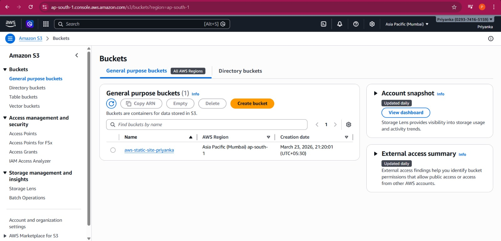
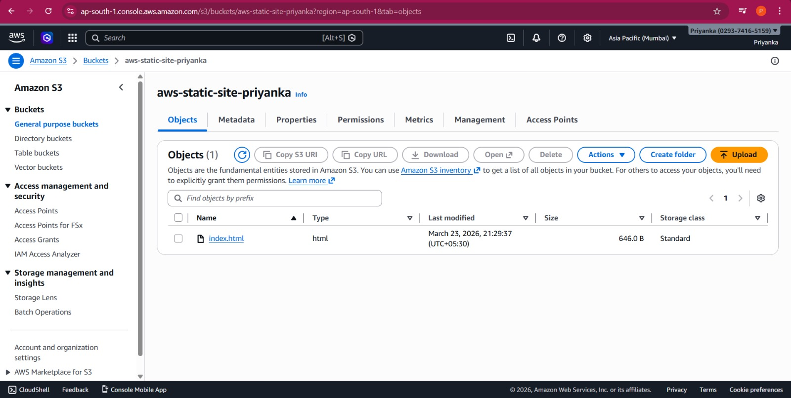
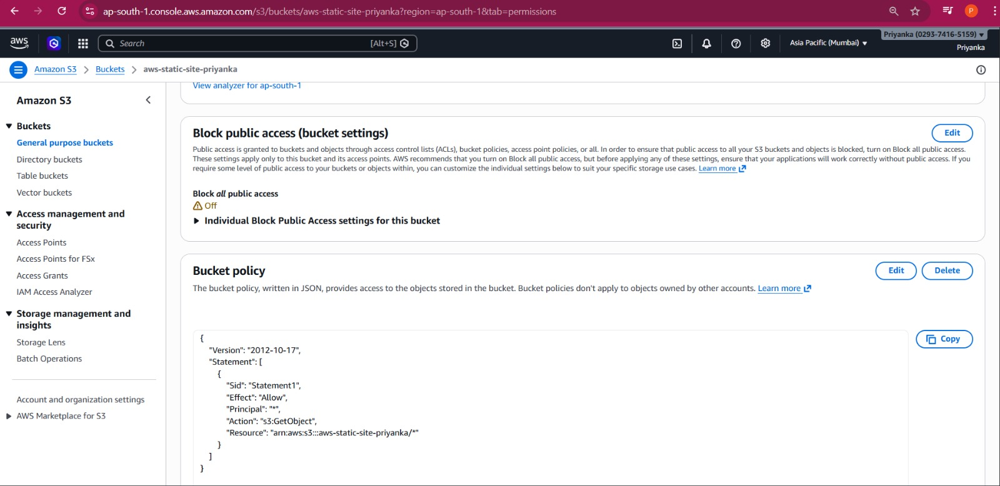
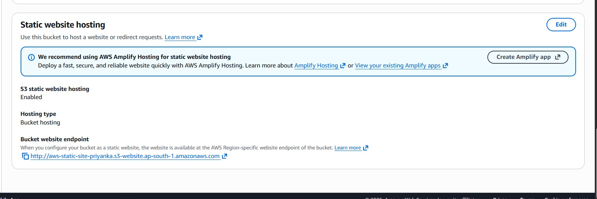
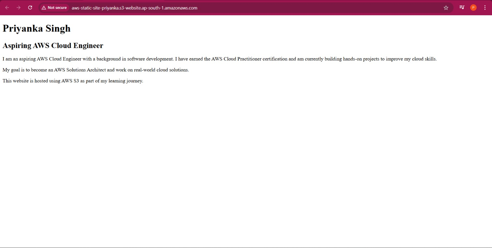

# AWS S3 Static Website Hosting

## Project Overview
This project demonstrates serverless static website hosting without using a backend server.

I created a simple personal webpage and deployed it using AWS S3 static website hosting.

## Services Used
- Amazon S3
- Bucket Policy (for public access control)

## Steps Performed
1. Created an S3 bucket
2. Uploaded HTML file (index.html)
3. Disabled block public access
4. Added bucket policy to allow public access
5. Enabled static website hosting
6. Accessed website using S3 static website endpoint

## Live Website
http://aws-static-site-priyanka.s3-website.ap-south-1.amazonaws.com

## Learning Outcome
- Understood how to host static websites using AWS S3
- Learned about bucket policies and public access configuration
- Gained hands-on experience with serverless deployment

## Screenshots

### S3 Bucket

### Files in Bucket

### Permissions & Bucket Policy

### Static Website Hosting

### Live Website

